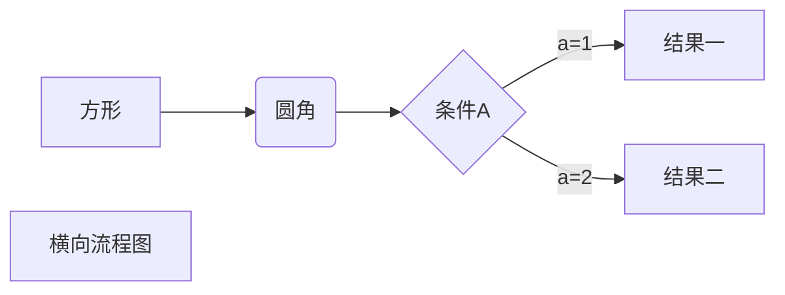
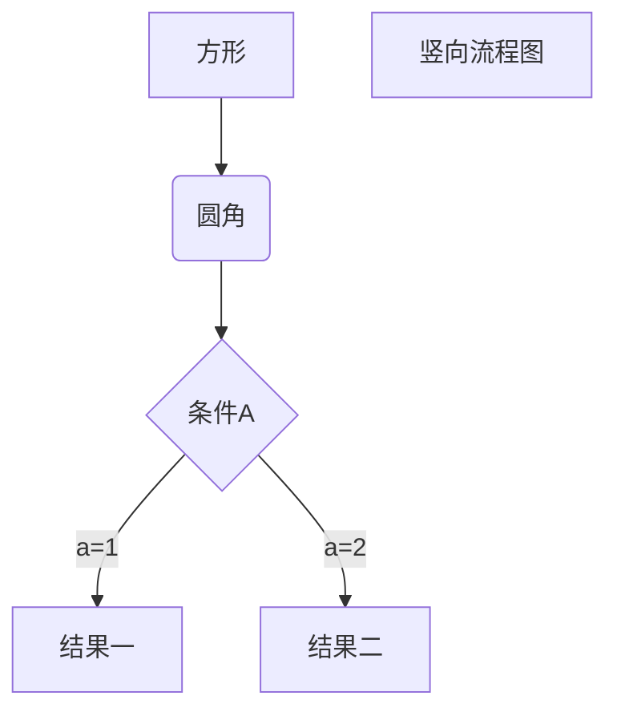

#                Typora的基本使用方法

### 一些快捷键

|   功能   | 快捷键 |
| :------: | :----: |
|   加粗   | Ctrl+B |
|   斜体   | Ctrl+I |
|   引用   | Ctrl+Q |
| 插入链接 | Ctrl+L |
| 插入代码 | Ctrl+K |
| 插入图片 | Ctrl+G |
| 提升标题 | Ctrl+H |
| 有序列表 | Ctrl+O |
| 无序列表 | Ctrl+U |


### 1.分级标题

使用简单的  ctrl+数字键  可快速完成各种级别的标题

# 标题

## 标题

也可以使用一到六个#来表示一到六级标题

#### ####标题

### 2.下划线，删除线，加粗，倾斜

<u>ctrl + u</u>

~~alt + shift + 5~~

**ctrl + b**

*ctrl + i*

***倾斜加粗***

### 3.无序列表

-+space + enter  在一级列表下打空格+tab键会出现二级列表，在二级列表下继续以上操作出现三级列表

或者ctrl+shift+]生成一级列表

或者 使用 *，+，- 表示无序列表。（注意：符号后面一定要有一个空格，起到缩进的作用。） 

- 

+ 
  +  
    +  

### 4.有序列表

数字键 + . +space

或者ctrl+shift+[

1. 

2. 
3. 

**注意：在使用列表时，只要是数字后面加上英文的点，就会无意间产生列表，比如2017.12.30 这时候想表达的是日期，有些软件把它被误认为是列表。解决方式：在每个点前面加上\就可以了。 **

2019\.11\.13

### 5.引用

ctrl + shift + q

或者在被引用的文本前加上>符号，以及一个空格就可以了，如果只输入了一个>符号会产生一个空白的引用。 

> 

> 

引用的嵌套使用

> > >
> >
> > 

### 6.插入链接

ctrl + k

 Markdown 支持以比较简短的自动链接形式来处理网址和电子邮件信箱，只要是用<>包起来， Markdown 就会自动把它转成链接。也可以直接写，也是可以显示成链接形式的 

< https://blog.csdn.net/u014061630/article/details/81359144 >

 https://blog.csdn.net/u014061630/article/details/81359144 

[]()

### 7.插入图片

本地直接拖拉图片到MD文件或者ctrl + shift + i


### 8.代码块

 插入程序代码的方式有两种，一种是利用缩进(tab), 另一种是利用英文“`”符号（一般在ESC键下方，和~同一个键）包裹代码。 

（C语言实验作业，找水仙花数)

```c
#include<stdio.h> 
#include<math.h>
int main()
{
	int n,i,sum,x,y;
	printf("请输入一个大于等于三的n:\n");
	scanf("%d",&n);
	for(i=pow(10,(n-1));i<pow(10,n);i++)
	{
		y = i;
		sum = 0;
		while(y>0)
		{
			x = y%10;
			sum += pow(x,n);
			y = y/10;
		}
		if(sum == i){
			printf("%d\n",i);
		}
		
	}
	return 0;
}
```

 行内式：如果在一个行内需要引用代码，只要用反引号`引起来就好（一般在ESC键下方，和~同一个键） `

### 9.快速生成表格

|      |      |      |
| ---- | ---- | ---- |
|      |      |      |
|      |      |      |
|      |      |      |

| 姓名 | 性别 | 成绩 |
| ---- | ---- | ---- |
|      |      |      |
|      |      |      |
|      |      |      |

### 10.着重关键字

ctrl + shift + 反引号键（tab键上面那个键）

### 11.新建文件

ctrl + n

### 12.显示和隐藏侧边栏

ctrl + shift + l

### 13.分割线

--- + enter

----

### 14.高亮显示

==文字==

### 

### 15.特殊符号

 对于 Markdown 中的语法符号，前面加反斜线\即可显示符号本身。 

\*

\#

&#10084;

&#9733;

 字符对应的Unicode码  https://unicode-table.com/cn/ 

### 16.数学公式

  $\sqrt{ x^{2}+\sqrt{y} }$ 

 $e^{x^2} \neq {e^x}^2$ 

 $\underbrace{ a+b+\cdots+z }_{26}$ 

 https://link.jianshu.com/?t=http%3A%2F%2Fblog.csdn.net%2Ftestcs_dn%2Farticle%2Fdetails%2F44229085

 https://www.mohu.org/info/symbols/symbols.htm 

### 17.流程图





