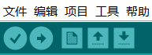
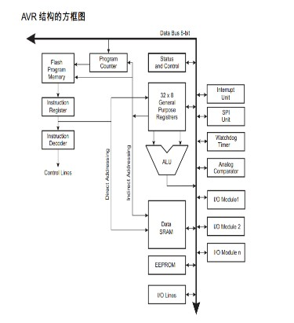
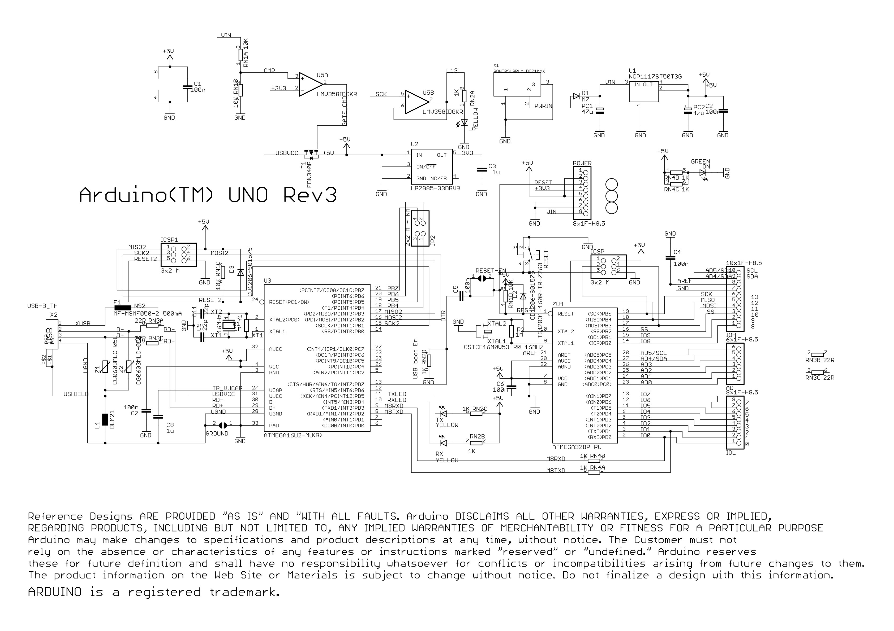
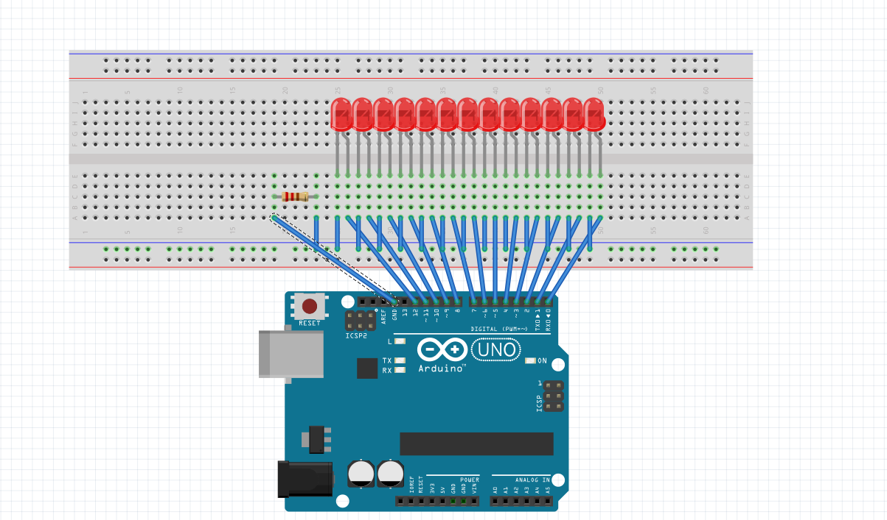
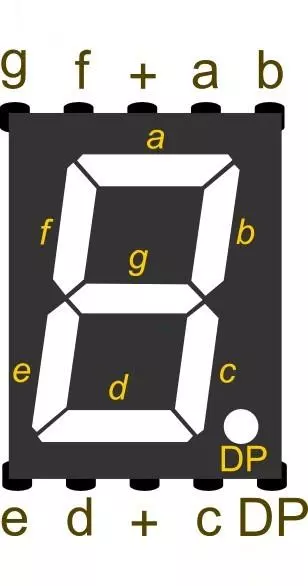
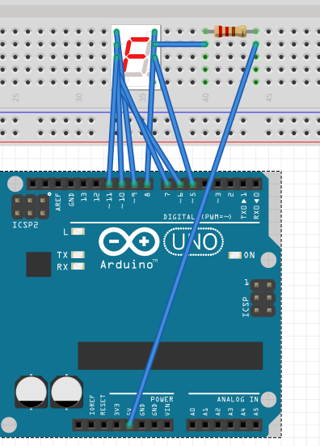
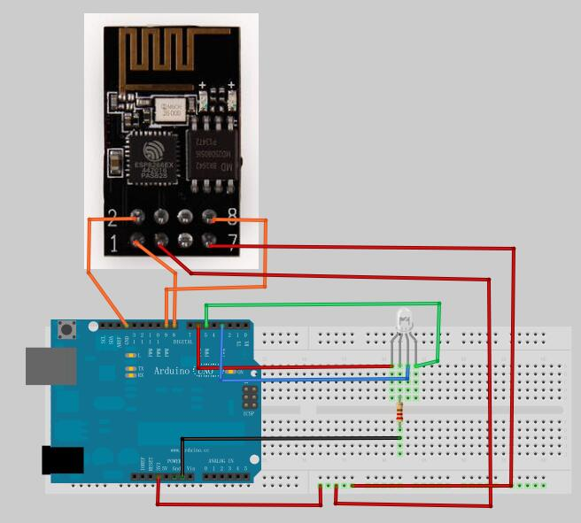
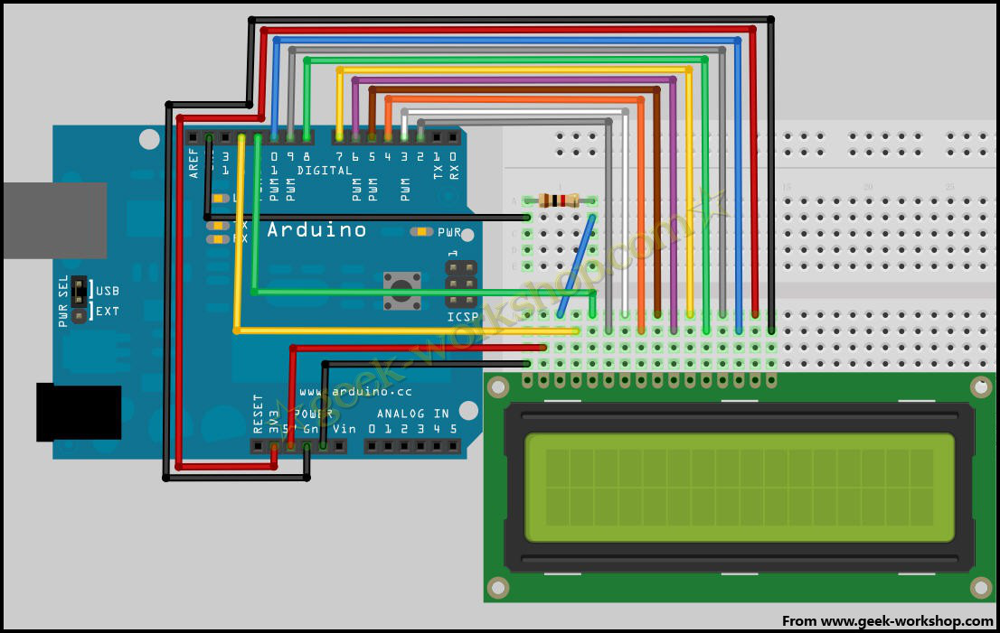

# arduino

## 目录

[目录](#目录)

[搭建开发环境](#搭建开发环境)

​	[arduino IDE的介绍](#arduino IDE的介绍)

​	[图形化软件ardublock](#图形化软件ardublock)

​	[仿真软件virtual breadboard](#仿真软件virtual breadboard)

[arduino语法](#arduino语法)

​	[跟C不同之处](#跟C不同之处)

​		[程序框架结构](#程序框架结构)

​		[常量](#常量)

​		[函数](#函数)

[硬件](#硬件)

​	[电子技术基础学习](#电子技术基础学习)

​	[arduino uno r3简介](#arduino no r3简介)

[arduino实例（更新中）](#arduino实例（更新中）)

​	[流水灯](#流水灯)

​	[一位数码管](#一位数码管)

​	[Wi-Fi模块控制PWM_LED](#Wi-Fi模块控制PWM_LED)

​	[LCD1602](#LCD1602)


##  搭建开发环境

### arduino IDE的介绍

- arduino IDE 下载地址< https://www.arduino.cc/en/Main/Software>

- 工具栏

  从左往右依次为编译、上传、新建程序、打开程序、保存程序

  - 文件菜单
    - 新建文件
    - 打开文件
    - 文件另存为
    - 关闭文件
    - 打印文件
  - 编辑菜单（编辑文本时常用的选项集合）
  - 程序菜单
    - 编译（和工具栏相同）
    - 显示文件夹
    - 增加文件（将一个其他程序复制到当前程序中，并在 编辑器窗口的新选项卡中打开）
    - 导入库（导入所引用的arduino库文件）
  - 工具菜单
    - 自动格式化
    - 程序打包（将程序文件夹中所有文件整合到一个压缩文件中）
    - 修复编码并重新装载（太酷了这个）
    - 串口监视器（pc和开发板沟通的工具）
    - 串口（设置开发板所连接的串口）
    - 板卡（选择开发板的型号）
    - 烧写（将arduino开发板变成一个芯片编程器）
  - 帮助菜单

### 图形化软件ardublock

- 给不会c的人用的拼拼乐

### 仿真软件virtual breadboard

- 麻麻再也不用担心我买不起开发板了

## arduino语法

跟C类似的地方不多赘述

### 跟C不同之处

#### 程序框架结构

- setup（）

用于初始化变量、设置针脚的输入输出类型、配置串口、引入库文件等

注： 每次arduino上电或者重启后setup（）函数只能运行一次

- loop（）

不断循环，根据反馈相应的改变执行情况；通过该函数动态控制arduino的主控板

- 库函数

| 库文件名              | 说明                                                         |
| --------------------- | ------------------------------------------------------------ |
| EEPROM                | 对“永久存储器”进行读和写                                     |
| Ethernet              | 用于通过 Arduino 以太网扩展板连接到互联网                    |
| Firmata               | 与电脑上应用程序通信的标准串行协议。                         |
| LiquidCrystal         | 与电脑上应用程序通信的标准串行协议。                         |
| SD                    | 对 SD 卡进行读写操作                                         |
| Servo                 | 控制伺服电机                                                 |
| SPI                   | 与使用的串行外设接口（SPI）总线的设备进行通信                |
| SoftwareSerial        | 使用任何数字引脚进行串行通信                                 |
| Stepper               | 控制步进电机                                                 |
| WiFi                  | 用于通过 Aduino 的 WiFi 扩展板连接到互联网                   |
| Wire                  | 双总线接口（TWI/I2C）通过网络对设备或者传感器发送和接收数据。 |
| PWM Frequency Library | 自定义PWM频率                                                |

#### 常量

- 数字引脚常量：INPUT和OUTPUT
  - INPUT 从引脚中读取数据
  - OUTPUT 引脚向外部电路输出数据
- 引脚电压常量：HIGH和LOW
  - HIGH 高电位
  - LOW 低电位

#### 函数

- pinMode(接口名称，数字引脚常量) ：将指定接口定义为输入/输出接口
- digitalWrite（接口名称，引脚电压常量）：将数字输入/输出接口置高或置低
- digitalRead（接口名称）：读出数字接口的值，并将其作为返回值
- analogWrite（接口名称，数值）：给一个模拟接口写一个模拟值
- analogRead（接口名称）：从指定的接口中读取模拟数值（会进行数字转换，将0 ~ 5V电压值转换为1 ~ 1023之间的整数值,并将该整数值作为返回值）
- delay（时间）：延时，时间以毫秒为单位
- Serial.begin（波特率）：设置串行每秒传输数据的速率，用在setup（）里
- Serial.begin（）：读取串行端口中持续输入的数据
- Serial.print（数据，数据的进制）：从串行端口输出数据
- Serial.println（数据，数据的进制）：从串行端口输出数据，输出的数据后跟随一个回车和一个换行符

## 硬件

### 电子技术基础学习

- 电路图 推荐Fritzing软件，直观又方便（

- 电子元件→[模块大礼包](../arduino/芯片及模块资料)
  - 电阻
  
  - 发光二极管（LED）极易烧坏，必接电阻（别问我为什么知道
  
  - （机械）开关（键盘也是一种开关嗷
    - 波动开关
    - 微动开关
    - 按钮开关
    - DPI开关等
    
  - 电容（滤波、耦合）
  
  - 晶体振荡器（以机械的方式产生系统时钟信号）
  
  - 七段数码管（接完LCD1602和点阵你会发现这东西无比的简单
  
  - 米字数码管
  
  - 蜂鸣器（上面的纸就是拿来撕的
  
  - 三极管（用来实现小电流控制大电流的功能）
  
    有三个引脚：基极（B）、集电极（C）、发射集（E）
  
  - 三态缓冲器74125（驱动能力强、低功耗，芯片内部有四个独立的缓冲器）
  
  - 二极管（单向导通）
  
  - 光电耦合器（实现光-电-光转换）
  
  - 电位器（内部等价为滑动变阻器）
  
    三个引脚：A、B、P
  
  - 继电器
  
    - 用小电流控制大电流的自动开关
    - 电路中起自动调节、安全保护、转换电路等作用
  
- 基本工具

  - 万用表
  - 电烙铁、焊锡、松香（简单实验用不着、开发需要）
  - 万能板（洞洞板）
  - 剥线钳（用牙代替）

### arduino uno r3简介

因为只会arduino uno r3所以只详细写了这玩意，硬件中关于芯片和模块的详细构造都不是很理解（尬笑.jpg

- 搭载单片机：Atmel AVR单片机（使用RISC结构8位单片机）

  - AVR结构框图

  

  - 状态寄存器标志位

    | 位   | 标志符号 | 描述         |
    | ---- | -------- | ------------ |
    | 0    | C        | 进位         |
    | 1    | Z        | 零位         |
    | 2    | N        | 负数         |
    | 3    | V        | 溢出         |
    | 4    | S        | 符号位       |
    | 5    | H        | 半进位       |
    | 6    | T        | 测试位       |
    | 7    | I        | 全局中断允许 |

  - 数据存储器
    - 数据存储器空间直接选址
    - 数据存储器空间寄存器间接取址
    - 数据存储器空间堆栈寄存器SP间接寻址
  - 片内外围设备
    - 通用输入输出
    - 外部中断
    - 定时器/计数器（可以产生PWM信号）
    - USRAT通用同步/异步接收转发器

- arduino uno r3原理图（看不懂）



## arduino实例（更新中）

记录自己做过的实验

### 流水灯

- 没有模块接线图

  

- 代码

``` c
void setup() {
  // put your setup code here, to run once:
  for(int i = 0;i <= 12;i++)
    pinMode(i,OUTPUT);
  
}

#define interval 200
void loop() {
  // put your main code here, to run repeatedly:
  digitalWrite(0,LOW);
  digitalWrite(1,HIGH);
  delay(interval);
  
  digitalWrite(1,LOW);
  digitalWrite(2,HIGH);
  delay(interval);
  
  digitalWrite(2,LOW);
  digitalWrite(3,HIGH);
  delay(interval);
  
  digitalWrite(3,LOW);
  digitalWrite(4,HIGH);
  delay(interval);
  
  digitalWrite(4,LOW);
  digitalWrite(5,HIGH);
  delay(interval);
  
  digitalWrite(5,LOW);
  digitalWrite(6,HIGH);
  delay(interval);
  
  digitalWrite(6,LOW);
  digitalWrite(7,HIGH);
  delay(interval);

  digitalWrite(7,LOW);
  digitalWrite(8,HIGH);
  delay(interval);

  digitalWrite(8,LOW);
  digitalWrite(9,HIGH);
  delay(interval);

  digitalWrite(9,LOW);
  digitalWrite(10,HIGH);
  delay(interval);
  
  digitalWrite(10,LOW);
  digitalWrite(11,HIGH);
  delay(interval);

  digitalWrite(11,LOW);
  digitalWrite(12,HIGH);
  delay(200);
}
```

### 一位数码管

- 一位数码管引脚图

  

- 接线图

  

- 代码

  ```c
  //设置控制各段的数字IO脚，具体几号引脚对应哪一段，来源为数码管官方引脚图。
  int pin_a = 9;
  int pin_b = 8;
  int pin_c = 5;
  int pin_d = 6;
  int pin_e = 7;
  int pin_f = 10;
  int pin_g = 11;
  int pin_p = 4;
  
  unsigned char table[10][8] =
  {
   {0, 1, 0, 0, 0, 0, 0, 0},   //0
   {0, 1, 1, 1, 1, 0, 0, 1},   //1
   {0, 0, 1, 0, 0, 1, 0, 0},   //2
   {0, 0, 1, 1, 0, 0, 0, 0},   //3
   {0, 0, 0, 1, 1, 0, 0, 1},   //4
   {0, 0, 0, 1, 0, 0, 1, 0},   //5
   {0, 0, 0, 0, 0, 0, 1, 0},   //6
   {0, 1, 1, 1, 1, 0, 0, 0},   //7
   {0, 0, 0, 0, 0, 0, 0, 0},   //8
   {0, 0, 0, 1, 0, 0, 0, 0}   //9
  };
  
  void setup()
  {
  for (int i = 4; i <= 11; i++)
  {
  pinMode(i, OUTPUT); //设置4～11引脚为输出模式
  }
  }
  
  void loop()
  {
   unsigned char i;
  
   for( i = 10 ; i > 0 ; i--)    //循环显示0-9
   {
    digitalWrite(pin_a,table[i-1][7]); //设置a引脚的电平
    digitalWrite(pin_b,table[i-1][6]);
    digitalWrite(pin_c,table[i-1][5]);
    digitalWrite(pin_d,table[i-1][4]);
    digitalWrite(pin_e,table[i-1][3]);
    digitalWrite(pin_f,table[i-1][2]);
    digitalWrite(pin_g,table[i-1][1]);
    digitalWrite(pin_p,table[i-1][0]);
  
    delay(1000);      //延迟1s
   }
  }
  ```

  

### Wi-Fi模块控制PWM_LED

WiFi控制apk用的tb赠送资料

- Wi-Fi模块接线图

  

- 代码

```c
#include <SoftwareSerial.h>

#define WIFI_TX       9
#define WIFI_RX       8
SoftwareSerial wifi(WIFI_RX, WIFI_TX);   //RX, TX
 String _comdata_wifi = "";             //for incoming wifi serial data

int BlueColor=000;
int GreenColor=255;
int RedColor=100;

int BluePin=3;
int GreenPin=5;
int RedPin=6;

void setup() {

  Serial.begin(9600);
  wifi.begin(115200); 
  Serial.println("system is ready!");
  wifi.println("AT+CWMODE=3\r\n");
  delay(500);
  wifi.println("AT+CIPMUX=1\r\n");
  delay(500);
  wifi.println("AT+CIPSERVER=1,5000\r\n");
  delay(500);
}

void loop() {
  
  if(Serial.available()){
    String order = "";
    while (Serial.available()){
      char cc = (char)Serial.read();
      order += cc;
      delay(2);
    }
    order.trim();
    wifi.println(order);
  }
String wifidata=getWifiSerialData();
    if(wifidata!=""){
    Serial.println(wifidata);
 Serial.println(wifidata.substring(12,15));
if(wifidata.substring(12,15)=="RGB")
  {
      RedColor=wifidata.substring(15,18).toInt();
      GreenColor=wifidata.substring(18,21).toInt();
      BlueColor=wifidata.substring(21,24).toInt();
      colorRGB(RedColor,GreenColor,BlueColor); 
      Serial.print(GreenColor);
      Serial.print(RedColor);
      Serial.print(BlueColor);
       Serial.print("\r\n");
      delay(20);
  }
  }
  wifidata="";
}

void colorRGB(int red, int green, int blue){
      analogWrite(RedPin,constrain(red,1,255));
      analogWrite(GreenPin,constrain(green,1,255));
      analogWrite(BluePin,constrain(blue,1,255));
}

String readTtl() {
  String comdata = "";
  while (Serial.available())
  {
    comdata += char(Serial.read());
    delay(2);
  }
  return comdata;
}

String getWifiSerialData(){
  String _comdata_wifi = "";             //for incoming wifi serial data
  while (wifi.available()>0){
    _comdata_wifi += char(wifi.read());   //get wifi data
  }
   return _comdata_wifi;
}
```

- 操作步骤
  - 手机上下载[apk](../arduino/其他资料/javaapk.com-MyClient.apk)并安装
  - 接线
  - 编译并上传上述代码
  - 连接wifi
  - 打开app,进行控制

### LCD1602

- 接线图

  

- 代码

  ```c
  int DI = 12;
  int RW = 11;
  int DB[] = {3, 4, 5, 6, 7, 8, 9, 10};
  int Enable = 2;
  
  void LcdCommandWrite(int value) {
  int i = 0;
  for (i=DB[0]; i <= DI; i++) 
  {
    digitalWrite(i,value & 01);
    value >>= 1;
  }
   
  digitalWrite(Enable,LOW);
  delayMicroseconds(1);
  digitalWrite(Enable,HIGH);
  delayMicroseconds(1);
  digitalWrite(Enable,LOW);
  delayMicroseconds(1);
  
  }
  
  void LcdDataWrite(int value) {
  int i = 0;
  digitalWrite(DI, HIGH);
  digitalWrite(RW, LOW);
  for (i=DB[0]; i <= DB[7]; i++) {
    digitalWrite(i,value & 01);
    value >>= 1;
  }
  
  digitalWrite(Enable,LOW);
  delayMicroseconds(1);
  digitalWrite(Enable,HIGH);
  delayMicroseconds(1);
  digitalWrite(Enable,LOW);
  delayMicroseconds(1);
  }
  
  void setup (void) {
  int i = 0;
  for (i=Enable; i <= DI; i++) {
    pinMode(i,OUTPUT);
  }
  delay(100);
  LcdCommandWrite(0x38);  
  delay(64);
  LcdCommandWrite(0x38);  
  delay(50);  
  LcdCommandWrite(0x38);  
  delay(20);  
  LcdCommandWrite(0x06);
  delay(20);
  LcdCommandWrite(0x0E);
  delay(20);
  LcdCommandWrite(0x01);
  delay(100);
  LcdCommandWrite(0x80);
  delay(20);
  }
  
  void loop (void) {
    LcdCommandWrite(0x01);
    delay(10); 
    LcdCommandWrite(0x80+3); 
    delay(10);
    LcdDataWrite('I');
    LcdDataWrite(' ');
    LcdDataWrite('a');
    LcdDataWrite('m');
    LcdDataWrite(' ');
    LcdDataWrite('a');
    LcdDataWrite(' ');
    LcdDataWrite('p');
    LcdDataWrite('i');
    LcdDataWrite('e');
    LcdDataWrite('c');
    LcdDataWrite('e');
    delay(3000);
    LcdCommandWrite(0x01);
    delay(10);
    LcdDataWrite(' ');
    LcdDataWrite('o');
    LcdDataWrite('f');
    LcdDataWrite(' ');
    LcdDataWrite('s');
    LcdDataWrite('h');
    LcdDataWrite('i');
    LcdDataWrite('t');
    delay(3000);
  }
  ```

  