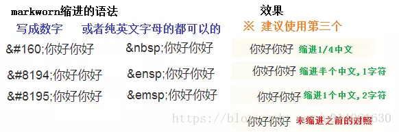
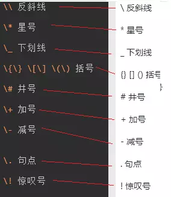
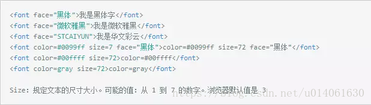
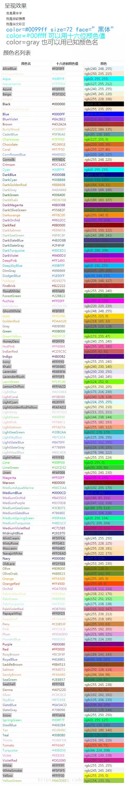
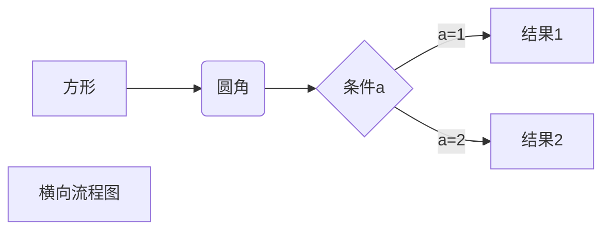
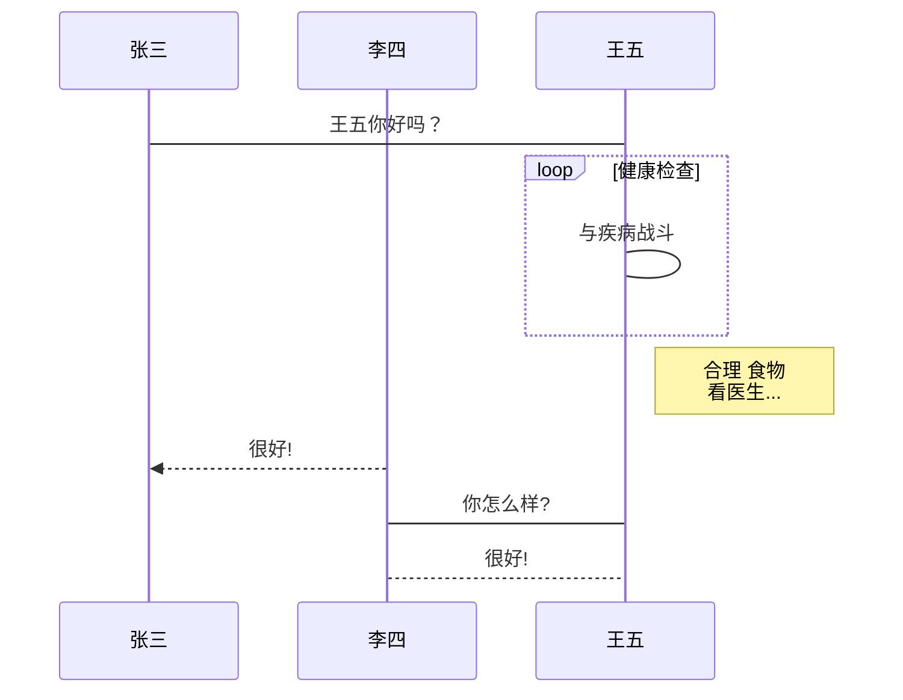
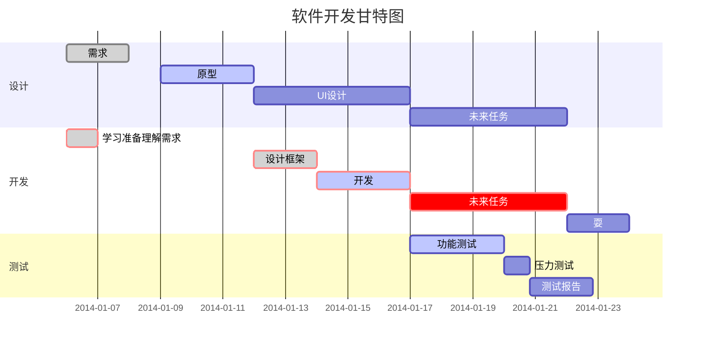

# markdown 基本语法{#1}

## 目录

- [toc] + enter 快速生成目录

[toc]

- 锚点（内部超链接）

   [超链接] (#需要跳转的标题)
  
  锚点创建目录
  
  [markdown 基本语法](#markdown-基本语法)
  
  [目录](#目录)
  
  [标题](#标题)
  
  [文本编辑](#文本编辑)
  
  [构建列表](#构建列表)
  
  [引用](#引用)
  
  [插入链接](#插入链接)
  
  [选中搜索和替换](#选中搜索和替换)
  
  [生成表格](#生成表格)
  
  [快捷操作](#快捷操作)
  
  [代码块](#代码块)
  
  [缩进字符](#缩进字符)
  
  [特殊符号](#特殊符号)
  
  [字体字号与颜色](#字体字号与颜色)
  
  [markdown 高端操作](#markdown-高端操作)
  
  [LaTeX数学公式](#latex数学公式)
  
  [简单规则](#简单规则)
  
  [常用数字符号](#常用数字符号)
  
  [Todo列表](#todo列表)
  
  [流程图](#流程图)
  
  [时序图](#时序图)
  
  [甘特图](#甘特图)
  
- web锚点

     <a id="titleA">titleA</a>  

     <a id="titleB">titleB</a>  

    [toA](#titleA) 

    [toB][#titleB] 

## 标题

/# 一级标题

/## 二级标题

1-6#代表1-6级标题  


## 文本编辑

ctrl + u	<u>下划线</u>

 alt + shift + 5 	~~删除线~~

 ctrl + b 	**字体加粗**

 ctrl + i 	*字体倾斜*

ctrl + shift + f   转换繁简体

==文字==	高亮显示

文字[^脚注]	定义脚注

 ctrl + shift + b或者英文状态下的引号，输入字母自动显示表情符号

⭕

 --- + enter 	分割线(三个以上*或_也可)

---


## 构建列表

 \- + space + enter    构建无序列表

- a
- b
- c    
- d
- e                      
  - 
    -  

 数字键 +英文符号+ space + enter	构建有序列表

1. a
2. b
3. c
4. d
5. e

嵌套列表：在父层的基础上按tab

 注意事项
在使用列表时，只要是数字后面加上英文的点，就会无意间产生列表，比如2017.12.30 这时候想表达的是日期，有些软件把它被误认为是列表。解决方式：在每个点前面加上\就可以了。 


## 引用

/ >+space + enter 或者 ctrl + shift + q	引用

> markdow

/>> 嵌套引用

> > > markdown
> >
> > markdown
>
> markdown
>
> > markdown


## 插入链接

- 插入图片链接

  本地直接拖拉图片到 md 文件 或者配合 MPic完成图片上传片并复制链接到 md 文件（推荐）或者 ctrl + shift +i

- ctrl + k	[插入链接]( [https://blog.csdn.net/u014061630/article/details/81359144#25-%E4%BB%A3%E7%A0%81%E5%9D%97](https://blog.csdn.net/u014061630/article/details/81359144#25-代码块) )

- 自动连接

   Markdown 支持以比较简短的自动链接形式来处理网址和电子邮件信箱，只要是用<>包起来， Markdown 就会自动把它转成链接。也可以直接写，也是可以显示成链接形式的 

  < [https://blog.csdn.net/u014061630/article/details/81359144#25-%E4%BB%A3%E7%A0%81%E5%9D%97](https://blog.csdn.net/u014061630/article/details/81359144#25-代码块) >

  

- 相对路径
  - ./当前目录
  - ../父级目录
  - /根目录


## 选中搜索和替换

ctrl + d 或者 ctrl + shift + left/right 左右进行文本选中

ctrl + l	按行选中

ctrl + f	快速搜索

ctrl + h	替换


## 生成表格

ctrl + t	快速生成表格

|      |      |      |
| ---- | ---- | ---- |
|      |      |      |
|      |      |      |
|      |      |      |


## 快捷操作

ctrl + home 跳转至文章开头，ctrl + end 跳转至文章末尾

ctrl + p	快速打开笔记

[toc] + enter	快速生成目录


ctrl + shift + l	显示和隐藏侧边栏

f11	全屏切换


## 代码块

- 行内式
  - `ctrl + shift + 反引号键（tab 键上面那个键）或者两个反引号键中间加内容`
- "`"    代码块

  - 语法高亮      在需要高亮的代码快之前使用三个反引号包裹

```c
#include <stdio.h>
int main(){
    printf("hellow world\n");
    
    return 0;
}
```


## 缩进字符



## 特殊符号




## 字体字号与颜色../markdown/图片



# markdown 高端操作

## LaTeX数学公式

### 简单规则

- 空格：LaTeX中空格用来隔开单词(英语一类字母文字)，多个空格等效于一个空格；对中文没有作用。
- 换行：用控制命令“\”,或“ \newline”.
- 分段：用控制命令“\par” 或空出一行。
- 换页：用控制命令“\newpage”或“\clearpage”
- 特殊控制字符：#，$, %, &, - ,{, }, ^, ~


### 常用数学符号

< https://www.mohu.org/info/symbols/symbols.htm >

< https://blog.csdn.net/HaleyPKU/article/details/80341932 >


## Todo 列表

- [ ] 未处理的事（- [ ] )

- [x] 已处理的事(- [x])


## 流程图

- 横向流程图



```rust
graph LR
A[方形] -->B(圆角)
    B --> C{条件a}
    C -->|a=1| D[结果1]
    C -->|a=2| E[结果2]
    F[横向流程图]
```


- 纵向流程图

  ```mermaid
  graph TD
  A[方形] -->B(圆角)
      B --> C{条件a}
      C -->|a=1| D[结果1]
      C -->|a=2| E[结果2]
      F[竖向流程图]
  ```

```rust
graph TD
A[方形] -->B(圆角)
    B --> C{条件a}
    C -->|a=1| D[结果1]
    C -->|a=2| E[结果2]
    F[竖向流程图]
```


- 标准流程图源码格式

  ```flow
  st=>start: 开始框
  op=>operation: 处理框
  cond=>condition: 判断框(是或否?)
  sub1=>subroutine: 子流程
  io=>inputoutput: 输入输出框
  e=>end: 结束框
  st->op->cond
  cond(yes)->io->e
  cond(no)->sub1(right)->op
  ```

```php
st=>start: 开始框
op=>operation: 处理框
cond=>condition: 判断框(是或否?)
sub1=>subroutine: 子流程
io=>inputoutput: 输入输出框
e=>end: 结束框
st->op->cond
cond(yes)->io->e
cond(no)->sub1(right)->op
```

- 标准流程图原码格式（横向）

  ```flow
  st=>start: 开始框
  op=>operation: 处理框
  cond=>condition: 判断框(是或否?)
  sub1=>subroutine: 子流程
  io=>inputoutput: 输入输出框
  e=>end: 结束框
  st(right)->op(right)->cond
  cond(yes)->io(bottom)->e
  cond(no)->sub1(right)->op
  
  ```

```php
st=>start: 开始框
op=>operation: 处理框
cond=>condition: 判断框(是或否?)
sub1=>subroutine: 子流程
io=>inputoutput: 输入输出框
e=>end: 结束框
st(right)->op(right)->cond
cond(yes)->io(bottom)->e
cond(no)->sub1(right)->op
```

## 时序图

- 简单样例

```sequence
对象A->对象B: 对象B你好吗?（请求）
Note right of 对象B: 对象B的描述
Note left of 对象A: 对象A的描述(提示)
对象B-->对象A: 我很好(响应)
对象A->对象B: 你真的好吗？
```

```rust
对象A->对象B: 对象B你好吗?（请求）
Note right of 对象B: 对象B的描述
Note left of 对象A: 对象A的描述(提示)
对象B-->对象A: 我很好(响应)
对象A->对象B: 你真的好吗？
```

- 复杂样例

```sequence
Title: 标题：复杂使用
对象A->对象B: 对象B你好吗?（请求）
Note right of 对象B: 对象B的描述
Note left of 对象A: 对象A的描述(提示)
对象B-->对象A: 我很好(响应)
对象B->小三: 你好吗
小三-->>对象A: 对象B找我了
对象A->对象B: 你真的好吗？
Note over 小三,对象B: 我们是朋友
participant C
Note right of C: 没人陪我玩
```

```rust
Title: 标题：复杂使用
对象A->对象B: 对象B你好吗?（请求）
Note right of 对象B: 对象B的描述
Note left of 对象A: 对象A的描述(提示)
对象B-->对象A: 我很好(响应)
对象B->小三: 你好吗
小三-->>对象A: 对象B找我了
对象A->对象B: 你真的好吗？
Note over 小三,对象B: 我们是朋友
participant C
Note right of C: 没人陪我玩

```

- 标准样例



```rust
%% 时序图例子,-> 直线，-->虚线，->>实线箭头
  sequenceDiagram
    participant 张三
    participant 李四
    张三->王五: 王五你好吗？
    loop 健康检查
        王五->王五: 与疾病战斗
    end
    Note right of 王五: 合理 食物 <br/>看医生...
    李四-->>张三: 很好!
    王五->李四: 你怎么样?
    李四-->王五: 很好!
```


## 甘特图



```css
%% 语法示例
        gantt
        dateFormat  YYYY-MM-DD
        title 软件开发甘特图

        section 设计
        需求                      :done,    des1, 2014-01-06,2014-01-08
        原型                      :active,  des2, 2014-01-09, 3d
        UI设计                     :         des3, after des2, 5d
    未来任务                     :         des4, after des3, 5d

        section 开发
        学习准备理解需求                      :crit, done, 2014-01-06,24h
        设计框架                             :crit, done, after des2, 2d
        开发                                 :crit, active, 3d
        未来任务                              :crit, 5d
        耍                                   :2d

        section 测试
        功能测试                              :active, a1, after des3, 3d
        压力测试                               :after a1  , 20h
        测试报告                               : 48h
```